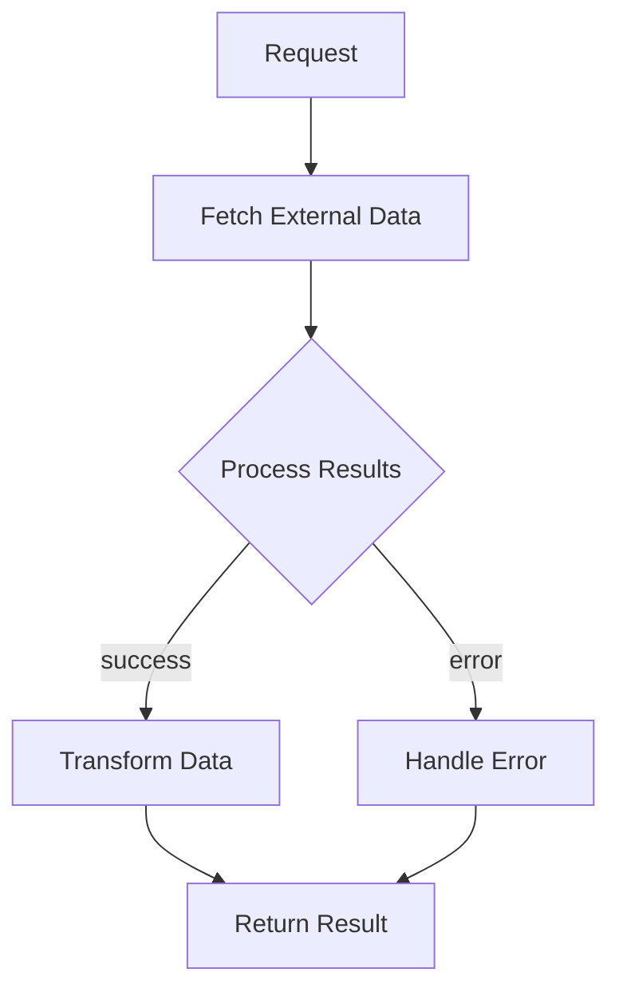

# SKILL: Document Task

You are creating documentation for a task in the opencouncil-tasks codebase. Follow these instructions to produce consistent, useful documentation.

## Output Location

Create `docs/{taskName}.md` where `{taskName}` matches the task file name (e.g., `pollDecisions` → `docs/pollDecisions.md`).

## Document Structure

Use this template:

```markdown
# {Task Name} Task

### Overview
{One paragraph explaining what the task does, when it's used, and its primary purpose.}

### Architecture
- Orchestration: src/tasks/{taskName}.ts
- {Additional files}: src/tasks/utils/{utilFile}.ts (if applicable)
- Types: src/types.ts

- Flow
{Mermaid flowchart showing the main processing steps}

### Input/Output Contract
- Input: {RequestType} (see src/types.ts)
  - {field}: {description}
  - {field}: {description}
- Output: {ResultType} (see src/types.ts)
  - {field}: {description}

- File References
  - Orchestration: src/tasks/{taskName}.ts
  - Types: src/types.ts

### Processing Pipeline
{Numbered list of processing steps with details}

### Dependencies
- External services: {list any APIs or services called}
- Libraries: {key npm packages used}
- Environment variables: {required env vars}

### Integration Points
- API endpoint: POST /tasks/{taskName}
- CLI command: {cli command if applicable}
- Related tasks: {other tasks this works with}

### Configuration
- Env vars
  - {VAR_NAME}: {description}
- Parameters (request)
  - {param}: {description and options}

### Key Functions & Utilities
{List important functions with brief descriptions}

### Data Flow & State Management
{Explain if stateless or stateful, any caching, temporary files}
```

## Guidelines

### Overview Section
- Be concise but complete
- Explain the "why" not just the "what"
- Mention integration context (e.g., "Used by opencouncil to...")

### Architecture Section
- List all relevant source files
- Include a Mermaid flowchart for complex tasks
- Show the main processing flow

### Input/Output Contract
- Document all fields in request and result types
- Note which fields are optional
- Include valid values for enums/unions

### Processing Pipeline
- Number each step
- Include enough detail for debugging
- Note any important algorithms or thresholds

### Dependencies
- List external services with their purpose
- Note required API keys or credentials
- Include version requirements if relevant

### Configuration
- Document all environment variables
- Include defaults where applicable
- Note production vs development differences

## Example Mermaid Flowchart



## Checklist

- [ ] Overview explains purpose clearly
- [ ] All source files listed in Architecture
- [ ] Flowchart shows main processing flow
- [ ] All request/result fields documented
- [ ] External services and API keys noted
- [ ] Environment variables listed
- [ ] Key functions described
- [ ] File placed in `docs/` directory
