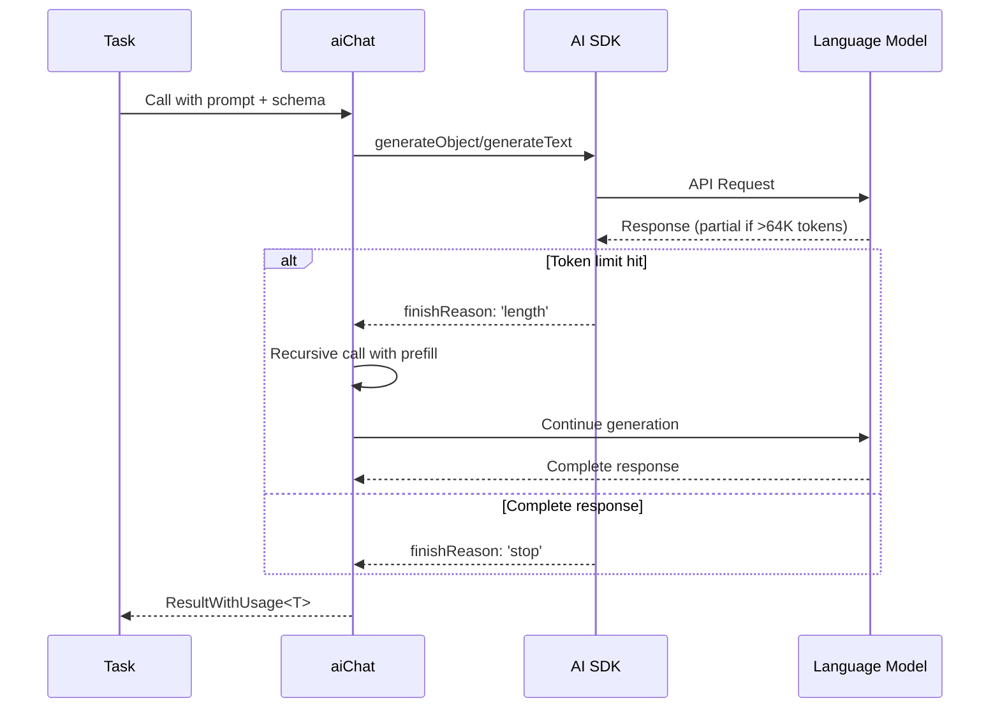

# AI Client

## Overview
The AI client layer (`src/lib/ai.ts`) provides a unified interface for all AI model interactions in the OpenCouncil system, wrapping the Vercel AI SDK with automatic retry logic, observability, token limit continuation, and usage tracking. It abstracts away the complexities of model provider APIs, enabling tasks to focus on prompt engineering and business logic rather than infrastructure concerns.

## Architecture
The module implements a middleware-based architecture where AI calls flow through multiple layers: the configured language model (via `aiClient.ts`), retry middleware for rate limit handling, and optional Langfuse telemetry for observability. Two primary execution paths exist: `generateText` for unstructured responses and `generateObject` for schema-validated structured outputs, both supporting automatic continuation when responses exceed token limits.

**File References**: [`ai.ts`](../src/lib/ai.ts), [`aiClient.ts`](../src/lib/aiClient.ts), [`telemetryContext.ts`](../src/lib/telemetryContext.ts), [`adaline.ts`](../src/lib/adaline.ts)

## Input/Output Contract
- **Input**: Functions accept configuration objects specifying prompts (`systemPrompt`, `userPrompt`), optional schema for structured output, document attachments (base64-encoded PDFs), response prefilling for continuation, and parsing preferences. The `aiChat` function supports both unstructured text and schema-validated structured outputs via optional Zod schemas.
- **Output**: All AI functions return `ResultWithUsage<T>` containing the typed result and detailed usage metrics (input tokens, output tokens, cache tokens). Token usage is accumulated across continuation calls when responses exceed limits.
- **File References**: [`Usage` type](../src/lib/ai.ts#L15-L20), [`ResultWithUsage` type](../src/lib/ai.ts#L25-L28), [`AiChatOptions` type](../src/lib/ai.ts#L46-L55)

## Processing Pipeline
AI calls execute through a multi-stage pipeline with automatic quality preservation:

1. **Message Construction**: Builds AI SDK message format, handling document attachments (PDF files as base64), user prompts, and optional prefilled assistant responses for continuation
2. **Telemetry Setup**: Configures Langfuse observability with sessionId and task context when `ENABLE_TELEMETRY=true`, enabling trace grouping and debugging
3. **Model Selection**: Routes to `generateObject` (schema-validated structured output) or `generateText` (unstructured response) based on schema presence
4. **Execution**: Calls the configured language model (see `aiClient.ts`) through middleware stack (retry → model), with temperature=0 for deterministic outputs
5. **Token Limit Detection**: Checks `finishReason === 'length'` indicating response truncation at configured token limit (default: 64K)
6. **Automatic Continuation**: Recursively calls `aiChat` with partial response as prefill, seamlessly completing truncated outputs while accumulating usage metrics
7. **Response Parsing**: Validates structured outputs against schema, parses JSON for text responses, handles type conversions

## Token Limit Continuation Logic

### How It Works
When a response reaches the 64,000 token limit (`maxOutputTokens`), the AI SDK returns `finishReason: 'length'` indicating truncation. The continuation logic automatically:
1. Takes the partial response (text or serialized structured object)
2. Feeds it back as a `prefillSystemResponse` to prime the next generation
3. Recursively calls `aiChat` to continue where it left off
4. Accumulates token usage from all continuation calls

### Quality Impact
**Positive**: 
- Seamless continuation preserves context and structure
- Schema-validated structured outputs remain valid even after continuation
- Arrays and objects are completed properly without malformation

**Considerations**:
- Each continuation adds latency (sequential API calls)
- Very long continuations (multiple rounds) may see slight coherence degradation
- The model treats the prefill as "already generated" content, maintaining consistency

### Cost Impact
**Important**: Continuation significantly increases token costs because:
- The partial response becomes input tokens for the next call
- Example: A 70K token response costs: 64K output + 64K input (for continuation) + 6K output = ~134K tokens total
- Multiple continuations compound this effect exponentially

**Best Practice**: Design prompts and chunking strategies to avoid hitting limits when possible.

### When Continuation Triggers
- Continuation triggers when a single API call generates ≥64K tokens of output
- This is **per-request**, not accumulated across multiple separate calls
- Most common in: bulk subject extraction, very long summarizations, large transcript processing

## Dependencies
- **Vercel AI SDK**: Provider abstraction and middleware system, enables model-agnostic code and retry middleware. Supports multiple providers (Anthropic, OpenAI, etc.)
- **Language Model Provider**: Configured in `aiClient.ts` (default: Anthropic Claude). Requires provider-specific API key (e.g., `ANTHROPIC_API_KEY`), subject to provider rate limits (handled by retry middleware)
- **Langfuse**: Optional observability platform for AI call tracing, requires `LANGFUSE_SECRET_KEY`, `LANGFUSE_PUBLIC_KEY`, `LANGFUSE_BASEURL` (enabled when `ENABLE_TELEMETRY=true`)
- **Adaline**: Optional prompt management platform for versioned prompts, requires `ADALINE_API_KEY`, used via `aiWithAdaline` function
- **Zod**: Schema validation library for structured outputs, ensures type safety and runtime validation

## Integration Points
- **Task Usage**: All tasks (summarize, transcribe, processAgenda, etc.) use `aiChat` as the primary interface for AI operations, with automatic retry and telemetry
- **Telemetry Context**: Tasks call `setTelemetryContext({ taskType, taskId })` before AI calls to enable trace grouping and session tracking in Langfuse
- **Middleware Stack**: Defined in [`aiClient.ts`](../src/lib/aiClient.ts), applies retry middleware to all AI calls automatically
- **Usage Tracking**: The `addUsage` helper accumulates token usage across multiple AI calls within a task for cost tracking and reporting
- **Session Grouping**: All AI calls within a task execution share a `sessionId` (timestamp-based) for Langfuse trace correlation

## Configuration
- **Model Provider API Key** (required): API key for the configured language model provider (see `aiClient.ts` for current configuration). Example: `ANTHROPIC_API_KEY` for Anthropic Claude
- `CAPTURE_PAYLOADS` (optional, default: `false`): Enables capturing of request payloads to disk for development and testing
- `ENABLE_TELEMETRY` (optional, default: `false`): Enables Langfuse telemetry for AI calls when set to `true`
- `LANGFUSE_SECRET_KEY` (optional): Secret key for Langfuse cloud, required when `ENABLE_TELEMETRY=true`
- `LANGFUSE_PUBLIC_KEY` (optional): Public key for Langfuse cloud, required when `ENABLE_TELEMETRY=true`
- `LANGFUSE_BASEURL` (optional, default: `https://cloud.langfuse.com`): Langfuse instance URL, can be self-hosted
- `ADALINE_API_KEY` (optional): API key for Adaline prompt management platform, only required when using `aiWithAdaline`

## Data Flow & State Management

### Stateless Design
Each `aiChat` call is stateless - no persistent state between calls. Task context (sessionId, taskType) is managed via AsyncLocalStorage in [`telemetryContext.ts`](../src/lib/telemetryContext.ts), enabling automatic trace correlation without explicit parameter passing.

### Token Usage Accumulation
Token usage flows through the system as immutable objects, accumulated using `addUsage`:
1. Each AI call returns fresh `Usage` object
2. Tasks accumulate usage across multiple calls using `addUsage`
3. Final usage reported in task result and Langfuse traces

### Continuation State
During token limit continuation, state flows through function parameters:
- `prefillSystemResponse`: The partial response to continue from (feeds into AI SDK messages)
- `prependToResponse`: Accumulates full response text across continuations
- Both are managed automatically within `aiChat`, transparent to calling code

### Concurrency
Multiple AI calls can execute concurrently (e.g., `Promise.all` for parallel subject enhancement), each with independent retry and telemetry tracking. Rate limiting is handled per-request by retry middleware.
