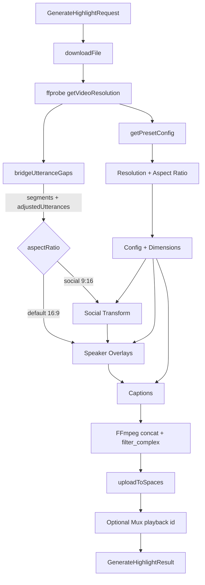
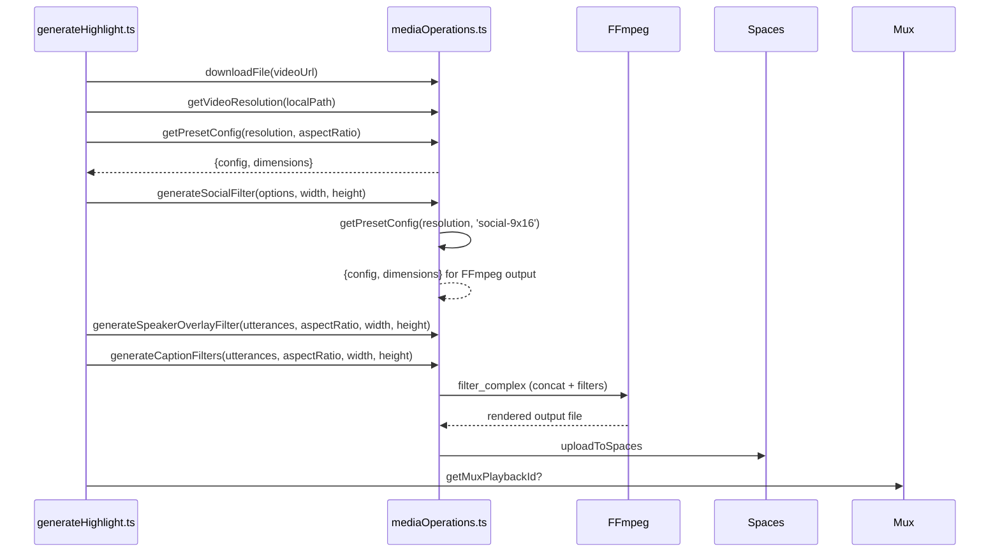

# Generate Highlight Task

### Overview
Produce short highlight clips from a source video using utterance time ranges. Builds an FFmpeg filter chain (optional social 9:16 transform, speaker overlays, captions), renders the composed video, uploads it, and returns final metadata. Resolution is detected via ffprobe and numeric layout uses resolution presets for consistent results.

### Architecture
- Orchestration: src/tasks/generateHighlight.ts
- Rendering/filter utilities: src/tasks/utils/mediaOperations.ts
- Types and shared enums: src/types.ts

- Flow

### Input/Output Contract
- Input: GenerateHighlightRequest (see src/types.ts)
  - media.type = 'video', media.videoUrl (mp4)
  - parts[].utterances[] with startTimestamp, endTimestamp, text, optional speaker
  - render.aspectRatio ('default' | 'social-9x16'), includeCaptions, includeSpeakerOverlay
  - render.socialOptions when social-9x16 (blur/solid margins, backgroundColor, zoomFactor)
- Output: GenerateHighlightResult (see src/types.ts)
  - Per-part: url, duration, startTimestamp, endTimestamp, optional muxPlaybackId

- File References
  - Orchestration: src/tasks/generateHighlight.ts
  - Media ops & filters: src/tasks/utils/mediaOperations.ts
  - Types: src/types.ts

### Processing Pipeline
1) Detect input resolution once
- downloadFile(videoUrl) to local cache under DATA_DIR
- getVideoResolution(localPath) via ffprobe (width/height)
2) Gap bridging and segment merging for smooth, optimized video
- bridgeUtteranceGaps(utterances, maxGapSeconds=2.0) extends utterance timestamps to bridge small gaps
- Avoids jarring cuts between consecutive utterances with millisecond-to-second gaps
- Only bridges gaps ≤2 seconds to preserve intentional pauses (e.g., speaker changes)
- mergeConsecutiveSegments() combines consecutive segments into continuous ranges
- **FFmpeg optimization**: 50 utterances with bridged gaps → 1 merged segment (instead of 50 trim+concat operations)
- Returns optimized video segments (for FFmpeg trimming) and adjusted utterances (for caption/overlay sync)
- Captions and overlays remain perfectly synchronized by using adjusted timestamps
3) Unified preset resolution system
- getPresetConfig(resolution, aspectRatio) returns both config and dimensions
- Handles 9:16 aspect ratio by finding corresponding 16:9 preset
- Uses sequential fallback (first available preset) if exact match not found
- Example: 640x360 + social-9x16 → uses 1280x720 preset's social config + 720x1280 dimensions
4) Social transform (optional)
- generateSocialFilter(options, inputVideoWidth, inputVideoHeight) uses preset dimensions
- generateSolidMarginFilter() and generateBlurredMarginFilter() get resolution from preset system
- FFmpeg output resolution matches preset dimensions (e.g., 720x1280 from 1280x720 preset)
5) Speaker overlays (optional)
- generateSpeakerOverlayFilter(adjustedUtterances, aspectRatio, inputVideoWidth, inputVideoHeight)
- Uses RESOLUTION_PRESETS.overlay[aspectRatio] from getPresetConfig()
- Renders drawbox background, drawtext name and wrapped role/party
- Uses adjustedUtterances from bridging to maintain sync with video segments
6) Captions (optional)
- generateCaptionFilters(adjustedUtterances, aspectRatio, inputVideoWidth, inputVideoHeight)
- Uses RESOLUTION_PRESETS.caption[aspectRatio] from getPresetConfig()
- Auto wraps and shrinks font to fit maxLines; draws drawtext with background box
- Uses adjustedUtterances from bridging to maintain sync with video segments
7) Concat + render
- Build filter_complex to trim bridged segments, concat, and apply combined filters
8) Upload & finalize
- uploadToSpaces returns final URL
- Optionally fetch Mux playback id

- Concat + Filters

### Dependencies
- Binaries/runtime: FFmpeg (execution via ffmpeg-static), ffprobe available in container (ffmpeg package)
- External services: DigitalOcean Spaces (S3-compatible) uploads; Mux (optional)
- Libraries: ffmpeg-static, aws-sdk, express, typescript, swagger-*
- Containers: Docker images install ffmpeg; dev image sets FFPROBE_PATH=/usr/bin/ffprobe

### Integration Points
- Task pipeline invokes generateHighlight
- Dev endpoints: src/routes/dev.ts
  - /dev/test-task/:taskType to drive tasks with payload capture/overrides
  - /dev/test-video-resolution to verify ffprobe resolution detection
- Storage: Spaces via uploadToSpaces
- Playback: Mux playback id post-upload

### Configuration
- Env vars
  - DATA_DIR (default ./data)
  - DO_SPACES_ENDPOINT, DO_SPACES_KEY, DO_SPACES_SECRET, DO_SPACES_BUCKET
  - CDN_BASE_URL for dev file serving
  - FFPROBE_PATH optional override (container sets /usr/bin/ffprobe)
  - PORT
- Render parameters (request)
  - aspectRatio, includeCaptions, includeSpeakerOverlay, socialOptions
- Presets & styling
  - Numeric per-resolution/per-aspect layout in RESOLUTION_PRESETS
  - Styling flags/colors in SPEAKER_OVERLAY_CONSTANTS and CAPTION_CONSTANTS

### Key Functions & Utilities
- Orchestration: generateHighlight(request, onProgress)
  - bridgeUtteranceGaps(utterances, maxGapSeconds) - bridge small gaps between utterances
  - mergeConsecutiveSegments(segments) - merge consecutive segments to optimize FFmpeg operations
- Media ops:
  - getVideoResolution(videoPath)
  - getPresetConfig(resolution, aspectRatio) - unified resolution system
  - generateSocialFilter(options, inputVideoWidth, inputVideoHeight)
  - generateSpeakerOverlayFilter(utterances, aspectRatio, inputVideoWidth, inputVideoHeight)
  - generateCaptionFilters(utterances, aspectRatio, inputVideoWidth, inputVideoHeight)
  - splitAndUploadMedia(mediaUrl, type, segments, spacesPath, onProgress, videoFilters?)
  - downloadFile(url)
- Presets
  - RESOLUTION_PRESETS: { caption: { 'default'|'social-9x16'? }, overlay: { 'default'|'social-9x16'? } }
  - getPresetConfig() handles aspect ratio swapping and sequential fallback

### Data Flow & State Management
- Stateless per request; no persistent state.
- Temporary files under DATA_DIR; font cached.
- Each request composes an independent FFmpeg command; progress reported via onProgress.
- Unified resolution system: all functions use getPresetConfig() for consistent behavior.
- Fallback logic: missing aspect ratio configs fall back to first available preset.