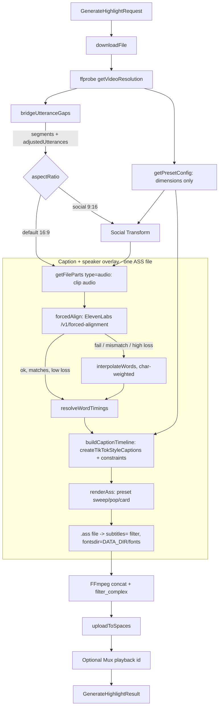
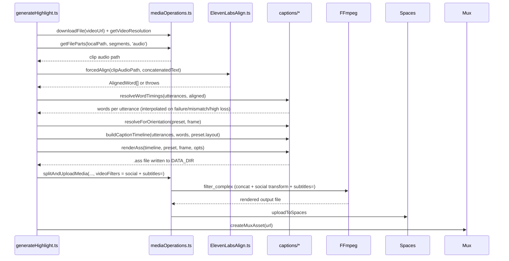

# Generate Highlight Task

### Overview
Produce short highlight clips from a source video using utterance time ranges. Builds an FFmpeg filter chain (optional social 9:16 transform, then captions + speaker overlay), renders the composed video, uploads it, and returns final metadata. Resolution is detected via ffprobe; captions and the speaker overlay are burned in as a single ASS subtitle file rendered by libass, replacing the previous per-word drawtext filters.

### Architecture
- Orchestration: src/tasks/generateHighlight.ts
- Media/filter utilities: src/tasks/utils/mediaOperations.ts
- Forced alignment client: src/lib/ElevenLabsAlign.ts
- Caption pipeline: src/lib/captions/ (wordTimings.ts, timeline.ts, presets.ts, assRenderer.ts, assFormat.ts, fonts.ts, types.ts)
- Types and shared enums: src/types.ts

- Flow

```mermaid
flowchart TD
  A[GenerateHighlightRequest] --> B[downloadFile]
  B --> C[ffprobe getVideoResolution]
  C --> BG[bridgeUtteranceGaps]
  BG -->|segments + adjustedUtterances| D{aspectRatio}
  D -- default 16:9 --> P1
  D -- social 9:16 --> SOC[Social Transform] --> P1
  P6 --> G[FFmpeg concat + filter_complex]
  G --> H[uploadToSpaces]
  H --> I[Optional Mux playback id]
  I --> J[GenerateHighlightResult]

  C --> K[getPresetConfig: dimensions only]
  K --> SOC
  K --> P4

  subgraph CAPTIONS[Caption + speaker overlay - one ASS file]
    direction TB
    P1[getFileParts type=audio: clip audio] --> P2[forcedAlign: ElevenLabs /v1/forced-alignment]
    P2 -- ok, matches, low loss --> P3[resolveWordTimings]
    P2 -- fail / mismatch / high loss --> P3W[interpolateWords, char-weighted] --> P3
    P3 --> P4[buildCaptionTimeline: createTikTokStyleCaptions + constraints]
    P4 --> P5[renderAss: preset sweep/pop/card]
    P5 --> P6[.ass file -> subtitles= filter, fontsdir=DATA_DIR/fonts]
  end
```

### Input/Output Contract
- Input: GenerateHighlightRequest (see src/types.ts)
  - media.type = 'video', media.videoUrl (mp4)
  - parts[].utterances[] with utteranceId, startTimestamp, endTimestamp, text, optional speaker { id, name, roleLabel, partyLabel, partyColorHex }
  - render.aspectRatio ('default' | 'social-9x16'), includeCaptions, includeSpeakerOverlay
  - render.captionStyle: 'team' | 'sweep' | 'pop' | 'card', optional — unknown/omitted values fall back to DEFAULT_PRESET_ID (an unknown id is logged)
  - render.socialOptions when social-9x16 (blur/solid margins, backgroundColor, zoomFactor)
- Output: GenerateHighlightResult (see src/types.ts)
  - Per-part: url, duration, startTimestamp, endTimestamp, optional muxPlaybackId, muxAssetId

- File References
  - Orchestration: src/tasks/generateHighlight.ts
  - Media ops & filters: src/tasks/utils/mediaOperations.ts
  - Alignment: src/lib/ElevenLabsAlign.ts
  - Captions: src/lib/captions/
  - Types: src/types.ts

### Processing Pipeline
1) Detect input resolution once
- downloadFile(videoUrl) to local cache under DATA_DIR
- getVideoResolution(localPath) via ffprobe (width/height)
2) Gap bridging and segment merging for smooth, optimized video
- bridgeUtteranceGaps(utterances, maxGapSeconds=2.0) extends utterance timestamps to bridge small gaps
- Only bridges gaps ≤2 seconds to preserve intentional pauses (e.g., speaker changes)
- mergeConsecutiveSegments() combines consecutive segments into continuous ranges
- Returns optimized video segments (for FFmpeg trimming) and adjusted utterances (for caption/overlay sync)
3) Preset resolution — dimensions only
- getPresetConfig(resolution, aspectRatio) returns output dimensions for the given source resolution/aspect ratio
- Handles 9:16 by finding the corresponding 16:9 preset and swapping width/height
- Sequential fallback (first available preset) if exact match not found
4) Social transform (optional)
- generateSocialFilter(options, inputVideoWidth, inputVideoHeight) uses getPresetConfig() dimensions
- generateSolidMarginFilter() / generateBlurredMarginFilter() build the scale/pad/blur chain
5) Captions + speaker overlay (optional) — single ASS file
- getFileParts(localVideoPath, segments, 'audio') extracts and concatenates the bridged segments' audio to one clip
- normalizeUtteranceTimestamps(adjustedUtterances) maps each utterance to clip-local ms timestamps (0-based, matching the extracted audio)
- forcedAlign(clipAudioPath, concatenatedText) POSTs the audio + all utterance text joined with spaces to ElevenLabs `/v1/forced-alignment`; one retry inside forcedAlign on failure; throws AlignmentError if ELEVENLABS_API_KEY is unset or both attempts fail
- resolveWordTimings validates the alignment: total aligned word count must equal the transcript's token count, and each utterance's mean word loss must be ≤ MAX_MEAN_LOSS (2.5). Utterances that fail either check — or the whole set if alignment failed/mismatched entirely — fall back to interpolateWords, which distributes an utterance's duration across its words proportional to word character length
- resolveForOrientation(preset, frame) flattens the preset's landscape override group when the output frame is landscape, so paging and rendering never branch on aspect ratio themselves
- buildCaptionTimeline: @remotion/captions' createTikTokStyleCaptions groups words into pages within combineWithinMs, then a constraint post-pass re-chunks by maxWordsPerPage and sentence-final punctuation (`. ! ? ; U+037E …`), extending short pages to minPageDurationMs
- Speaker spans are built by merging consecutive same-speaker utterances with zero gap between them
- renderAss(timeline, preset, frame, opts) emits one ASS document: karaoke `\kf` fill events for the 'sweep' preset, per-word color+scale override events for 'pop'/'card'; speaker chip events with a vector-drawn (`\p`) party-color accent bar plus name and role (else party) text
- Written to `DATA_DIR/captions-<random>.ass`; referenced by `subtitles=filename='...':fontsdir='DATA_DIR/fonts'`, appended to the filter chain after the social transform
- The clip audio file is always deleted (best-effort) once captions are built; alignment never blocks the render — any failure at any stage falls through to interpolation
6) Concat + render
- Build filter_complex to trim bridged segments, concat, and apply the combined filter chain (social transform, then `subtitles=`)
7) Upload & finalize
- uploadToSpaces returns final URL
- On success the `.ass` file is deleted; on failure it is left in DATA_DIR for debugging
- Optionally fetch Mux playback id and asset id

- Concat + Filters

```mermaid
sequenceDiagram
  participant GH as generateHighlight.ts
  participant MO as mediaOperations.ts
  participant EL as ElevenLabsAlign.ts
  participant CAP as captions/*
  participant FF as FFmpeg
  GH->>MO: downloadFile(videoUrl) + getVideoResolution
  GH->>MO: getFileParts(localPath, segments, 'audio')
  MO-->>GH: clip audio path
  GH->>EL: forcedAlign(clipAudioPath, concatenatedText)
  EL-->>GH: AlignedWord[] or throws
  GH->>CAP: resolveWordTimings(utterances, aligned)
  CAP-->>GH: words per utterance (interpolated on failure/mismatch/high loss)
  GH->>CAP: resolveForOrientation(preset, frame)
  GH->>CAP: buildCaptionTimeline(utterances, words, preset.layout)
  GH->>CAP: renderAss(timeline, preset, frame, opts)
  CAP-->>GH: .ass file written to DATA_DIR
  GH->>MO: splitAndUploadMedia(..., videoFilters = social + subtitles=)
  MO->>FF: filter_complex (concat + social transform + subtitles=)
  FF-->>MO: rendered output file
  MO->>Spaces: uploadToSpaces
  GH->>Mux: createMuxAsset(url)
```

### Dependencies
- Binaries/runtime: FFmpeg (execution via ffmpeg-static) with libass support, ffprobe available in container (ffmpeg package)
- External services:
  - DigitalOcean Spaces (S3-compatible) uploads
  - Mux (optional, for playback id)
  - ElevenLabs Scribe forced-alignment API (`/v1/forced-alignment`) — $0.22/audio-hour, roughly half a cent per typical highlight
- Libraries: ffmpeg-static, @remotion/captions (word-to-page grouping), aws-sdk, express, typescript, swagger-*
- Fonts: `ensureFonts()` populates `DATA_DIR/fonts`, the single directory handed to libass, from two sources:
  - Inter (Black for captions, Medium as the chip fallback) is committed at assets/fonts, so a render never depends on the network.
  - Relative Pro Book, the brand face the old drawtext overlay used, is fetched once from `CHIP_FONT_URL` and cached. It is proprietary, so it is not committed to this public repository; when the fetch fails the chip falls back to Inter Medium and logs it.
  - Internal font family names must match `CAPTION_PRESETS` exactly — libass silently substitutes otherwise. Enforced by src/lib/captions/fonts.test.ts, which gates on the full Greek alphabet including accented forms.
- Containers: Docker images install ffmpeg and `COPY` assets/fonts into the image; dev image sets FFPROBE_PATH=/usr/bin/ffprobe

### Integration Points
- Task pipeline invokes generateHighlight
- API endpoint: POST /generateHighlight (task version 2)
- CLI commands:
  - `node dist/cli.js highlight <requestFile>` — runs generateHighlight locally from a JSON GenerateHighlightRequest file
  - `node dist/cli.js align <audioFile> <text...>` — probes the forced-alignment API directly, printing per-word timestamps and loss
- Dev endpoints: src/routes/dev.ts (`/dev/test-upload`, `/dev/files/:bucket/*`) — generic upload/storage helpers, not highlight-specific
- Storage: Spaces via uploadToSpaces
- Playback: Mux playback id post-upload

### Configuration
- Env vars
  - DATA_DIR (default ./data)
  - DO_SPACES_ENDPOINT, DO_SPACES_KEY, DO_SPACES_SECRET, DO_SPACES_BUCKET
  - ELEVENLABS_API_KEY — required for forced alignment; missing/invalid key falls back to interpolated timings, render still succeeds
  - CHIP_FONT_URL optional override for the speaker chip's brand face (defaults to the copy on our CDN)
  - FFPROBE_PATH optional override (container sets /usr/bin/ffprobe)
  - PORT
- Render parameters (request)
  - aspectRatio, includeCaptions, includeSpeakerOverlay, captionStyle, socialOptions
- Runtime preset overrides
  - `CAPTIONS_CONFIG_PATH`, default `$DATA_DIR/captions.json` — a file on the mounted data volume, so styling changes take effect on the next render with no rebuild or redeploy. Production and staging have separate volumes, so each carries its own file.
  - Shape: `{ "default": "<preset id>", "presets": { "<id>": { …preset fields… } } }`. An id matching a built-in merges over it field by field; a new id defines a new preset and must be complete. `null` for `stroke`/`shadow`/`container` removes that section.
  - A preset exported by the caption studio can be pasted in as the whole file: a bare preset object is keyed by its own `id` and becomes the default. Exports predating per-orientation overrides (`position.landscapeYPct`) are converted on load.
  - Read once and re-read only when the file's mtime or size changes — a stat per render, no parse.
  - Validated on load: ranges are checked, `font.family` must be one of the fonts in the fonts directory (libass substitutes silently otherwise), and stroke/shadow are dropped when a container is present since ASS draws a box or an outline, never both. An invalid preset is skipped with a warning and the built-in stands; an unparseable file leaves the built-ins untouched. A bad config can never break a render.
  - The result reports `captionStyle` and `captionPresetHash` per part, so a rendered video can be traced to the exact styling that produced it even after the file changes.
- Presets & styling
  - src/tasks/utils/mediaOperations.ts: RESOLUTION_PRESETS — per-resolution social-9x16 output dimensions
  - src/lib/captions/presets.ts: CAPTION_PRESETS ('team' — the shipped default — plus 'sweep', 'pop', 'card') and DEFAULT_PRESET_ID — font, colors, stroke/shadow, container, emphasis style, page layout thresholds, position
  - Per-orientation values: a preset's font/layout/position are the portrait (9:16) base; an optional `landscape` group overrides any styling section — font, colors, stroke, shadow, container, emphasis, layout, position — for 16:9 output. Shipped presets place captions at 70% of frame height in portrait (inside the blurred band below the letterboxed video, above the platform UI) and 82–84% — lower-third — in landscape
  - resolveForOrientation(preset, frame) merges that group once per render; it is the only place orientation is considered, so a value set in one place cannot silently diverge between formats

### Key Functions & Utilities
- Orchestration: generateHighlight(request, onProgress)
  - bridgeUtteranceGaps(utterances, maxGapSeconds) - bridge small gaps between utterances
  - mergeConsecutiveSegments(segments) - merge consecutive segments to optimize FFmpeg operations
- Media ops (src/tasks/utils/mediaOperations.ts):
  - getVideoResolution(videoPath)
  - getPresetConfig(resolution, aspectRatio) - dimensions only
  - generateSocialFilter(options, inputVideoWidth, inputVideoHeight)
  - normalizeUtteranceTimestamps(utterances) - source-video time → clip-local ms
  - getFileParts(filePath, segments, type, videoFilters?) - trim/concat (+ optional filters) to one file
  - splitAndUploadMedia(mediaUrl, type, segments, spacesPath, onProgress, videoFilters?)
  - downloadFile(url)
- Alignment (src/lib/ElevenLabsAlign.ts):
  - forcedAlign(audioPath, text) - POST to ElevenLabs, one retry, throws AlignmentError
- Captions (src/lib/captions/):
  - resolveWordTimings(utterances, aligned) / interpolateWords(utterance) - wordTimings.ts
  - buildCaptionTimeline(utterances, wordsPerUtterance, layout) - timeline.ts
  - renderAss(timeline, preset, frame, opts) - assRenderer.ts
  - CAPTION_PRESETS, DEFAULT_PRESET_ID, resolveForOrientation(preset, frame) - presets.ts
  - getCaptionConfig(), presetFingerprint(preset) - presetConfig.ts (built-ins merged with the runtime override file)
  - getFontsDir() - fonts.ts

### Data Flow & State Management
- Stateless per request; no persistent state.
- Temporary files under DATA_DIR: downloaded video, extracted clip audio (deleted after captions are built), rendered `.ass` (deleted on success, left in place on failure for debugging).
- Each request composes an independent FFmpeg command; progress reported via onProgress.
- Alignment fallback ladder: alignment failure, token-count mismatch, or high mean loss on a given utterance falls back to char-weighted interpolation for that utterance — a render never fails due to alignment.
- Fallback logic: missing resolution/aspect ratio presets fall back to the first available preset.
