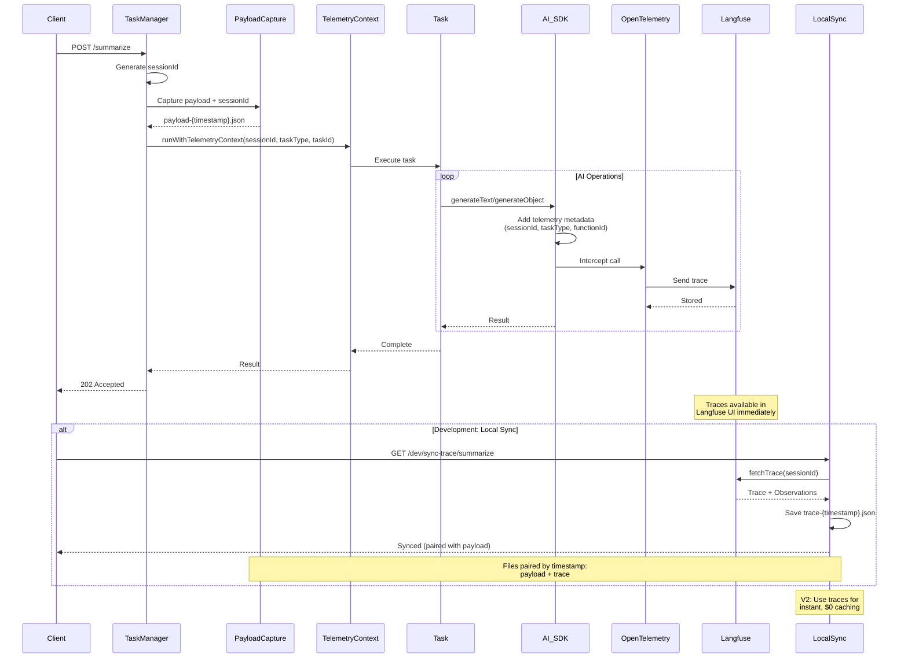

# Observability System

## Overview

Comprehensive tracing and monitoring of all AI operations using Langfuse and OpenTelemetry. The system automatically captures every AI SDK call with rich contextual metadata, enabling powerful filtering and analysis in the Langfuse UI.

## Complete Workflow



### Architecture Components

| Component | Purpose | Location |
|-----------|---------|----------|
| **Instrumentation** | OpenTelemetry + Langfuse initialization | [instrumentation.ts](../src/instrumentation.ts) |
| **Telemetry Context** | AsyncLocalStorage for context propagation | [telemetryContext.ts](../src/lib/telemetryContext.ts) |
| **Task Manager** | SessionId generation, context wrapping | [TaskManager.ts](../src/lib/TaskManager.ts) |
| **AI Client** | Enriches AI calls with metadata | [ai.ts](../src/lib/ai.ts) |
| **Langfuse Sync** | Downloads traces to local files | [langfuseSync.ts](../src/lib/langfuseSync.ts) |
| **Dev Routes** | Sync & management endpoints | [dev.ts](../src/routes/dev.ts) |

## Core Concepts

### SessionId: Trace Grouping
Each task execution gets a unique sessionId that groups all AI calls together.

**Format:** `{taskType}-{timestamp}-{uuid}`  
**Example:** `summarize-1729858800000-abc12345`

**Flow:**
1. TaskManager generates sessionId when task starts
2. All AI calls within that task inherit the sessionId via AsyncLocalStorage
3. Langfuse groups traces by sessionId for cost/latency analysis
4. SessionId links payload file to trace file for local caching

### Environment Tagging
Automatically separates development from production traces based on `NODE_ENV`.

**Use Cases:**
- Filter Langfuse UI by environment
- Analyze dev iterations separately from production traffic
- Keep development noise out of production analytics

### FunctionId: Descriptive Naming
AI calls are automatically tagged with hierarchical names showing task context.

**Pattern:** `{taskType}.{operation}`  
**Examples:** `summarize.aiChat-generateObject`, `processAgenda.aiWithAdaline`

### Metadata: Rich Context
Every trace automatically includes:
- `sessionId` - Groups all calls in a task
- `taskType` - Which task made the call
- `taskId` - Unique execution identifier

## Setup

### Required Environment Variables

```bash
# Langfuse cloud credentials (get from https://cloud.langfuse.com)
LANGFUSE_SECRET_KEY="sk-lf-..."
LANGFUSE_PUBLIC_KEY="pk-lf-..."
LANGFUSE_BASEURL="https://cloud.langfuse.com"  # or https://us.cloud.langfuse.com

# Enable telemetry and payload capture
CAPTURE_PAYLOADS="true"

# Optional: Environment tagging
NODE_ENV="development"
```

**Verification:**  
Server logs will show: `✅ Langfuse telemetry initialized (environment: development)`

## Using Langfuse UI

### Finding Traces
Server logs output sessionId for each task:
```
🔍 Task summarize [task_1] - Langfuse sessionId: summarize-1729858800000-abc12345
```

Use this sessionId to filter in the Langfuse UI and see:
- All AI calls for that task execution
- Timeline and latency waterfall
- Total cost and token usage
- Request/response details

### Common Langfuse Filters

| What to Analyze | Filter Expression |
|-----------------|------------------|
| Specific task execution | `sessionId = "summarize-1729080000000-abc123"` |
| All dev traces | `environment = "development"` |
| All production traces | `environment = "production"` |
| All summarize tasks | `metadata.taskType = "summarize"` |
| Structured generations only | `name contains "generateObject"` |
| Dev summarize tasks | `environment = "development" AND metadata.taskType = "summarize"` |

## Developer Integration

### Context Propagation (Automatic)

Telemetry context propagates automatically through:
- Promise chains
- Async/await
- Callbacks
- Timers

**No manual passing needed** - use `getTelemetryContext()` anywhere in the call chain.

### Adding Telemetry to New AI Calls

```typescript
import { getTelemetryContext } from './lib/telemetryContext.js';
import { generateText } from 'ai';
import { model } from './lib/aiClient.js';

export async function myNewFunction(input: string) {
  const context = getTelemetryContext();
  
  const result = await generateText({
    model,
    prompt: input,
    experimental_telemetry: process.env.CAPTURE_PAYLOADS === 'true' ? {
      isEnabled: true,
      functionId: context?.taskType 
        ? `${context.taskType}.myNewFunction` 
        : 'myNewFunction',
      metadata: {
        sessionId: context?.sessionId,
        taskType: context?.taskType,
        taskId: context?.taskId
      }
    } : undefined
  });
  
  return result.text;
}
```

**Key Functions:**
- `runWithTelemetryContext(context, fn)` - Wrap execution (TaskManager uses this)
- `getTelemetryContext()` - Get current context
- `getSessionId()` - Get current sessionId

---

## Local Trace Syncing

### Why Sync Locally?

While Langfuse cloud provides powerful analysis, local trace files enable:

1. **Offline development** - Work without internet or Langfuse UI
2. **Version control** - Commit traces as test fixtures
3. **Fast iteration** - Foundation for V2 caching (instant, $0 reruns)
4. **CI/CD testing** - Use traces for deterministic test fixtures

### Integrated Workflow

```
1. Task executes
   ├─ Payload captured with sessionId
   └─ Trace sent to Langfuse cloud

2. Development: Sync to local file
   └─ Paired files: payload + trace (linked by timestamp)

3. [V2] Use local trace for caching
   └─ Instant reruns without AI API calls
```

### File Pairing

Files are paired by timestamp for easy linking:

```
data/dev-payloads/
├── summarize-payload-2025-10-16T10-00-00-000Z.json  ← Payload
└── summarize-trace-2025-10-16T10-00-00-000Z.json   ← Trace (synced)
```

**Payload includes:**
- Original request data
- `sessionId` for linking to trace
- Task type and timestamp

**Trace includes:**
- All AI observations (chronological)
- Request/response data
- Token usage and timing
- Full Langfuse `ApiTrace` format (see [langfuseSync.ts](../src/lib/langfuseSync.ts))

### Sync Operations

**Endpoints:** See Swagger UI at `/api-docs` for:
- `GET /dev/sync-trace/:taskType` - Sync all or specific payloads
- `GET /dev/synced-traces/:taskType` - List synced traces

**Batch Sync:**  
Without `?payload=N` parameter, syncs ALL payloads for a task type (skips existing).

**Single Sync:**  
With `?payload=0` syncs specific payload (0 = latest).

**Force Overwrite:**  
Add `?force=true` to overwrite existing traces.
