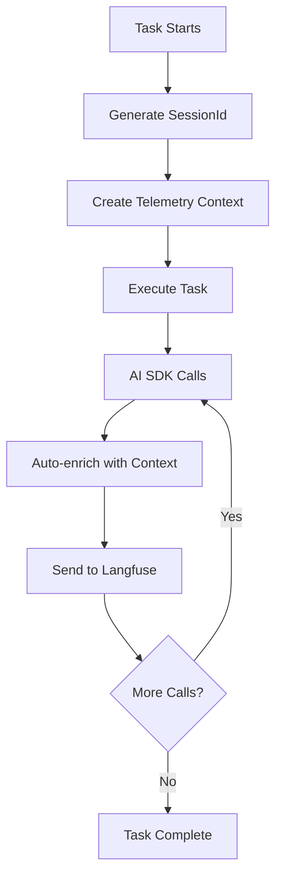

# Observability System

## Overview
Comprehensive tracing and monitoring of all AI operations using Langfuse and OpenTelemetry. Every AI SDK call is automatically instrumented with rich contextual metadata (sessionId, taskType, environment), enabling powerful filtering and analysis in the Langfuse UI.

## Architecture



### Components

1. **[instrumentation.ts](../src/instrumentation.ts)** - Initializes OpenTelemetry + Langfuse at server startup
2. **[telemetryContext.ts](../src/lib/telemetryContext.ts)** - AsyncLocalStorage for context propagation
3. **[TaskManager.ts](../src/lib/TaskManager.ts)** - Generates sessionId, wraps tasks in context
4. **[ai.ts](../src/lib/ai.ts)** - Enriches all AI calls with metadata

## Key Concepts

### SessionId - Task Grouping
Groups all AI calls within a single task execution.

- **Format**: `summarize-1729858800000-abc12345`
- **Usage**: Filter by sessionId to see all AI calls from one task
- **Benefit**: Calculate total cost/latency per task

### Environment Tagging
Separates development from production traces.

- **Logic**: `NODE_ENV === 'development'` → `development`, else → `production`
- **Usage**: Filter by environment to isolate dev/prod data
- **Benefit**: Keep development noise out of production analytics

### FunctionId - Descriptive Names
Human-readable trace names with task context.

- **Format**: `${taskType}.${operation}`
- **Examples**: 
  - `summarize.aiChat-generateObject`
  - `processAgenda.aiChat-generateText`
  - `summarize.aiWithAdaline`
- **Benefit**: Immediate clarity on which task made the call

### Metadata
Every trace includes:
```typescript
{
  sessionId: "summarize-1729858800000-abc12345",
  taskType: "summarize",
  taskId: "task_42"
}
```

## Configuration

### Setup

1. **Get Langfuse Credentials**: Sign up at [https://cloud.langfuse.com](https://cloud.langfuse.com) → Create project → Copy API keys

2. **Add to `.env`**:
   ```bash
   LANGFUSE_SECRET_KEY="sk-lf-..."
   LANGFUSE_PUBLIC_KEY="pk-lf-..."
   LANGFUSE_BASEURL="https://cloud.langfuse.com"  # or https://us.cloud.langfuse.com
   CAPTURE_PAYLOADS="true"
   ```

3. **Restart server** - Look for:
   ```
   🔍 Initializing Langfuse telemetry (environment: development)...
   ✅ Langfuse telemetry initialized
   ```

### Environment Variables

| Variable | Required | Description |
|----------|----------|-------------|
| `LANGFUSE_SECRET_KEY` | ✅ | Secret key from Langfuse project |
| `LANGFUSE_PUBLIC_KEY` | ✅ | Public key from Langfuse project |
| `LANGFUSE_BASEURL` | ✅ | `https://cloud.langfuse.com` or `https://us.cloud.langfuse.com` |
| `CAPTURE_PAYLOADS` | ✅ | Must be `"true"` to enable telemetry |
| `NODE_ENV` | ❌ | Set to `"development"` for dev environment |

## Usage

### Finding Traces

**1. Get SessionId from logs**:
```
🔍 Task summarize [task_1] - Langfuse sessionId: summarize-1729858800000-abc12345
```

**2. Filter in Langfuse UI**:
```
sessionId = "summarize-1729858800000-abc12345"
```

### Common Filters

| Goal | Filter |
|------|--------|
| All dev traces | `environment = "development"` |
| All production traces | `environment = "production"` |
| All summarize tasks | `metadata.taskType = "summarize"` |
| Specific task execution | `sessionId = "summarize-1729858800000-abc12345"` |
| All structured generations | `name contains "generateObject"` |
| Dev summarize only | `environment = "development" AND metadata.taskType = "summarize"` |

### Analyzing a Task Execution

1. Copy sessionId from server logs
2. Filter by sessionId in Langfuse
3. View timeline, costs, and latencies for all AI calls
4. Drill into individual traces for debugging

## Developer Integration

### Context Propagation

Context automatically propagates through:
- Promise chains
- Async/await
- Callbacks
- Timers

**You don't need to pass context as parameters** - it's accessible anywhere via `getTelemetryContext()`.

### Adding Observability to New Functions

```typescript
import { getTelemetryContext } from './lib/telemetryContext.js';
import { generateText } from 'ai';
import { model } from './lib/aiClient.js';

export async function myNewFunction(input: string) {
  const context = getTelemetryContext();
  
  const result = await generateText({
    model,
    prompt: input,
    experimental_telemetry: process.env.CAPTURE_PAYLOADS === 'true' ? {
      isEnabled: true,
      functionId: context?.taskType ? `${context.taskType}.myNewFunction` : 'myNewFunction',
      metadata: {
        sessionId: context?.sessionId,
        taskType: context?.taskType,
        taskId: context?.taskId
      }
    } : undefined
  });
  
  return result.text;
}
```

### API Reference

**`runWithTelemetryContext(context, fn)`**  
Wraps function execution in telemetry context (used by TaskManager)

**`getTelemetryContext()`**  
Returns current context or `undefined`

**`getSessionId()`**  
Returns current sessionId or `undefined`
