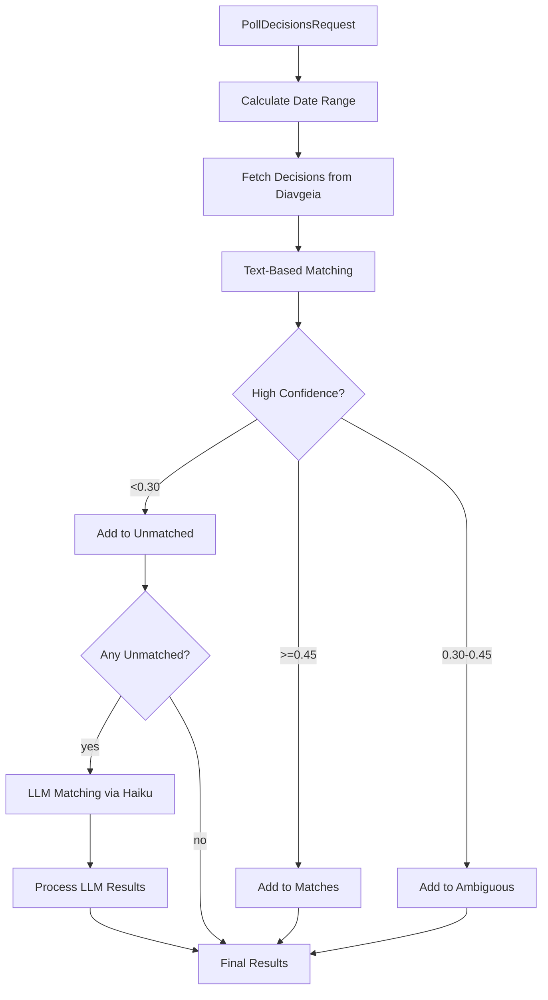

# Poll Decisions Task

### Overview
Fetch decisions from the Diavgeia (Greek Government Transparency) API and match them to meeting agenda subjects. Uses a two-phase matching strategy: fast text-based matching first, then LLM fallback for unmatched subjects. This task enables opencouncil to link council meeting agenda items to their official published decisions.

### Architecture
- Orchestration: src/tasks/pollDecisions.ts
- API Client: src/lib/DiavgeiaClient.ts
- AI Integration: src/lib/ai.ts (for LLM fallback)
- Types: src/types.ts

- Flow

```mermaid
flowchart TD
  A[PollDecisionsRequest] --> B[Calculate Date Range]
  B --> C[Fetch Decisions from Diavgeia]
  C --> D[Text-Based Matching]
  D --> E{High Confidence?}
  E -- >=0.45 --> F[Add to Matches]
  E -- 0.30-0.45 --> G[Add to Ambiguous]
  E -- <0.30 --> H[Add to Unmatched]
  H --> I{Any Unmatched?}
  I -- yes --> J[LLM Matching via Haiku]
  J --> K[Process LLM Results]
  K --> L[Final Results]
  I -- no --> L
  F --> L
  G --> L
```

### Input/Output Contract
- Input: PollDecisionsRequest (see src/types.ts)
  - meetingDate: ISO date of the meeting (YYYY-MM-DD)
  - diavgeiaUid: Organization UID on Diavgeia (e.g., "6104")
  - diavgeiaUnitIds: Optional array of unit IDs to filter results (e.g., ["81689"])
  - subjects: Array of { subjectId, name } from the meeting agenda
- Output: PollDecisionsResult (see src/types.ts)
  - matches: Successfully matched subjects with ADA, PDF URL, protocol number, issue date, confidence
  - unmatchedSubjects: Subjects with no matching decision (includes reason)
  - ambiguousSubjects: Subjects with multiple possible matches (includes candidates)
  - metadata: Query info and counts

- File References
  - Orchestration: src/tasks/pollDecisions.ts
  - Diavgeia Client: src/lib/DiavgeiaClient.ts
  - Types: src/types.ts

### Processing Pipeline

1) **Calculate Date Range**
   - Start: meeting date
   - End: meeting date + 45 days (decisions may be published later)

2) **Fetch Decisions from Diavgeia**
   - Uses DiavgeiaClient.fetchAllDecisions()
   - Filters by organization UID, date range, and optional unit IDs (one query per unit ID, deduplicated by ADA)
   - Handles pagination automatically (100 decisions per page)

3) **Text-Based Matching (First Pass)**
   For each subject, find the best matching decision using:
   - **Exact match**: Normalized text comparison (lowercase, punctuation removed)
   - **Containment**: One text contains the other
   - **Word coverage**: Handles brief subject vs verbose decision (threshold: 60%)
   - **Jaccard similarity**: Token-based similarity score

   Thresholds:
   - HIGH_CONFIDENCE_THRESHOLD = 0.45 (accept as match)
   - AMBIGUOUS_THRESHOLD = 0.30 (consider as candidate)

4) **LLM Matching (Second Pass)**
   For subjects that didn't match with high confidence:
   - Uses Claude 3.5 Haiku (cheap, fast)
   - Provides semantic matching for Greek word inflection differences
   - Returns confidence: 'high' (0.85), 'low' (0.6), or 'none'

5) **Return Results**
   - Matches with ADA, decision title, PDF URL, protocol number, issue date, confidence
   - Unmatched subjects with reasons
   - Ambiguous subjects with candidate list

### Dependencies
- External services:
  - Diavgeia API (https://diavgeia.gov.gr/opendata) - no authentication required
  - Anthropic Claude API (for LLM fallback)
- Libraries: Standard fetch for HTTP
- Environment variables:
  - ANTHROPIC_API_KEY (for LLM matching)

### Integration Points
- API endpoint: POST /tasks/pollDecisions
- CLI command: `npm run cli poll-decisions --subjects-file <file.json> --org-uid <uid> --meeting-date <date> [--unit-id <unitIds>]`
- Related tasks: Works with meeting processing in opencouncil

### Configuration
- Env vars
  - ANTHROPIC_API_KEY: Required for LLM fallback matching
- Parameters (request)
  - diavgeiaUnitIds: Filter to specific organizational units (recommended)
  - Date range: Automatically calculated as meetingDate to meetingDate + 45 days

### Key Functions & Utilities
- **normalizeText(text)**: Lowercase, remove quotes/punctuation, collapse whitespace
- **tokenize(text)**: Extract word tokens for similarity comparison
- **jaccardSimilarity(text1, text2)**: Token-based similarity (0-1)
- **wordCoverage(text1, text2)**: Percentage of shorter text's words in longer text
- **containsNormalized(text1, text2)**: Check if one contains the other
- **findBestMatch(subject, decisions, usedDecisions)**: Find best matching decision
- **llmMatchSubjects(unmatchedSubjects, availableDecisions)**: LLM fallback via Haiku

### Data Flow & State Management
- Stateless per request
- No persistent state or caching
- Tracks used decisions to prevent duplicate matches
- Progress reported via onProgress callback:
  - "fetching decisions" (10%)
  - "matching subjects" (50%)
  - "LLM matching" (70%)
  - "complete" (100%)

### Automated Polling (Cron Job)

The opencouncil frontend has a cron endpoint that automatically polls Diavgeia for recent meetings with unlinked subjects. This server can run the cron script to call that endpoint on a schedule.

#### Prerequisites

1. The opencouncil deployment must have `CRON_SECRET` set in its environment
2. Add `CRON_TARGET_URL` and `CRON_SECRET` to this server's `.env`:
   ```
   CRON_TARGET_URL=https://opencouncil.gr
   CRON_SECRET=<same secret as the opencouncil deployment>
   ```

#### Setup

1. **Test the script manually first:**
   ```bash
   ./scripts/poll-decisions-cron.sh
   ```

2. **Install the cron job** (runs every 12 hours):
   ```bash
   crontab -e
   ```
   Add this line:
   ```
   0 0,12 * * * /path/to/opencouncil-tasks/scripts/poll-decisions-cron.sh >> /path/to/opencouncil-tasks/logs/poll-decisions-cron.log 2>&1
   ```
   Replace `/path/to/opencouncil-tasks` with the actual absolute path on the server.

3. **Verify the cron job was saved:**
   ```bash
   crontab -l
   ```

4. **Create the logs directory:**
   ```bash
   mkdir -p logs
   ```

#### Monitoring

- **Check logs:**
  ```bash
  tail -f logs/poll-decisions-cron.log
  ```
- **Check polling stats** from the opencouncil admin UI at `/admin/diavgeia`.

### Related Documentation

- **API Reference:** See `docs/diavgeia-api-guide.md` for comprehensive Diavgeia API documentation including endpoints, filtering strategies, unit IDs, and common gotchas.
