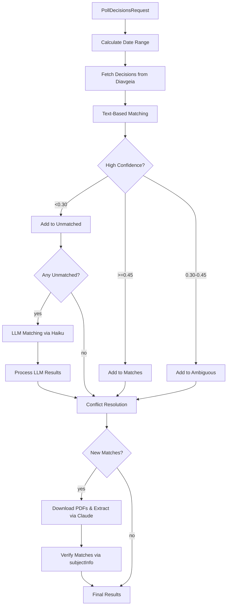

# Poll Decisions Task

### Overview
Fetch decisions from the Diavgeia (Greek Government Transparency) API, match them to meeting agenda subjects, extract structured data from matched PDFs, and verify matches using PDF content. Uses a multi-phase pipeline: fast text-based matching, LLM fallback for unmatched subjects, conflict resolution, PDF extraction via Claude, and subjectInfo verification. This task enables opencouncil to link council meeting agenda items to their official published decisions and extract attendance, votes, and excerpts in a single pass.

### Architecture
- Orchestration: src/tasks/pollDecisions.ts
- API Client: src/lib/DiavgeiaClient.ts
- AI Integration: src/lib/ai.ts (for LLM matching and PDF extraction)
- PDF Extraction: src/tasks/utils/decisionPdfExtraction.ts (single PDF), src/tasks/utils/extractionPipeline.ts (batch pipeline)
- Effective Attendance: src/tasks/utils/effectiveAttendance.ts
- Types: src/types.ts

- Flow

```mermaid
flowchart TD
  A[PollDecisionsRequest] --> B[Calculate Date Range]
  B --> C[Fetch Decisions from Diavgeia]
  C --> D[Text-Based Matching]
  D --> E{High Confidence?}
  E -- >=0.45 --> F[Add to Matches]
  E -- 0.30-0.45 --> G[Add to Ambiguous]
  E -- <0.30 --> H[Add to Unmatched]
  H --> I{Any Unmatched?}
  I -- yes --> J[LLM Matching via Haiku]
  J --> K[Process LLM Results]
  K --> L[Conflict Resolution]
  I -- no --> L
  F --> L
  G --> L
  L --> M{New Matches?}
  M -- yes --> N[Download PDFs & Extract via Claude]
  N --> O[Verify Matches via subjectInfo]
  O --> P[Final Results]
  M -- no --> P
```

### Input/Output Contract
- Input: PollDecisionsRequest (see src/types.ts)
  - meetingDate: ISO date of the meeting (YYYY-MM-DD)
  - diavgeiaUid: Organization UID on Diavgeia (e.g., "6104")
  - diavgeiaUnitIds: Optional array of unit IDs to filter results (e.g., ["81689"])
  - people: Array of { id, name } — council members for name matching during extraction
  - subjects: Array of { subjectId, name, agendaItemIndex, existingDecision? }
    - agendaItemIndex: number | null — used for subjectInfo verification
    - existingDecision: Optional { ada, decisionTitle, pdfUrl, needsExtraction? } — previously linked decisions (re-extracted if needsExtraction is true)
- Output: PollDecisionsResult (see src/types.ts)
  - matches: Successfully matched subjects with ADA, PDF URL, protocol number, publish date, confidence
  - reassignments: Decisions moved between subjects (with reason)
  - unmatchedSubjects: Subjects with no matching decision (includes reason)
  - ambiguousSubjects: Subjects with multiple possible matches (includes candidates)
  - extractions: Extracted data from matched PDFs, or null if no new matches
    - decisions: Array of ExtractedDecisionResult (excerpt, references, attendance, votes, subjectInfo)
    - warnings: Extraction warnings (unmatched member names, etc.)
  - costs: Token usage across all LLM calls (input, output, cache creation, cache read)
  - metadata: Query info and counts

- File References
  - Orchestration: src/tasks/pollDecisions.ts
  - Diavgeia Client: src/lib/DiavgeiaClient.ts
  - PDF Extraction: src/tasks/utils/decisionPdfExtraction.ts, src/tasks/utils/extractionPipeline.ts
  - Effective Attendance: src/tasks/utils/effectiveAttendance.ts
  - Types: src/types.ts

### Processing Pipeline

1) **Calculate Date Range**
   - Start: meeting date
   - End: meeting date + 45 days (decisions may be published later)

2) **Fetch Decisions from Diavgeia** (5%)
   - Uses DiavgeiaClient.fetchAllDecisions()
   - Filters by organization UID, date range, and optional unit IDs (one query per unit ID, deduplicated by ADA)
   - Handles pagination automatically (100 decisions per page)

3) **Text-Based Matching** (15%)
   For each subject, find the best matching decision using:
   - **Exact match**: Normalized text comparison (lowercase, punctuation removed)
   - **Containment**: One text contains the other
   - **Word coverage**: Handles brief subject vs verbose decision (threshold: 60%)
   - **Jaccard similarity**: Token-based similarity score

   Thresholds:
   - HIGH_CONFIDENCE_THRESHOLD = 0.45 (accept as match)
   - AMBIGUOUS_THRESHOLD = 0.30 (consider as candidate)

4) **LLM Matching** (35%)
   For subjects that didn't match with high confidence:
   - Uses Claude 3.5 Haiku (cheap, fast)
   - Provides semantic matching for Greek word inflection differences
   - Returns confidence: 'high' (0.85), 'low' (0.6), or 'none'
   - Returns usage for cost tracking

5) **Conflict Resolution** (45%)
   - Detects when multiple subjects match the same decision
   - Uses Claude to pick the best match with explanation
   - Returns usage for cost tracking

6) **PDF Extraction** (50-85%)
   For newly matched subjects plus subjects with `needsExtraction` (linked but no extraction data):
   - Downloads PDFs in batches of 5
   - Sends each PDF to Claude Sonnet for extraction
   - Extracts: excerpt, references, present/absent members, vote details, attendance changes (with timing), discussion order (with out-of-agenda items), subjectInfo
   - Performs meeting-level name matching (token-sort + Haiku LLM fallback) to map PDF member names to person IDs
   - Computes effective attendance per subject via `processRawExtraction()` — accounts for mid-meeting arrivals/departures and non-standard discussion order using each PDF's own data (self-contained)
   - Infers vote records from effective present members: unanimous ("Ομόφωνα") → all present get FOR; majority ("κατά πλειοψηφία") with only AGAINST/ABSTAIN listed → remaining present get FOR. All vote inference is handled here in the backend — the frontend writes `voteDetails` as-is

7) **Match Verification** (90%)
   For each extraction result, cross-checks `subjectInfo` (an `AgendaItemRef`) against the matched subject:
   - Regular subjects: `subjectInfo.agendaItemIndex` must match `agendaItemIndex` and `nonAgendaReason` must be null
   - outOfAgenda subjects (`agendaItemIndex: null`): `nonAgendaReason` must be `'outOfAgenda'`
   - On mismatch → match is discarded, subject moved to `unmatchedSubjects`
   - On number mismatch → attempts re-match to the subject with the correct `agendaItemIndex`

8) **Return Results** (100%)
   - Verified matches with ADA, decision title, PDF URL, protocol number, publish date, confidence
   - Extraction results with attendance, votes, excerpts per subject
   - Accumulated costs from all LLM calls
   - Unmatched subjects with reasons
   - Ambiguous subjects with candidate list

### Dependencies
- External services:
  - Diavgeia API (https://diavgeia.gov.gr/opendata) - no authentication required
  - Anthropic Claude API (Haiku for matching, Sonnet for PDF extraction)
- Libraries: Standard fetch for HTTP
- Environment variables:
  - ANTHROPIC_API_KEY (for LLM matching and PDF extraction)

### Integration Points
- API endpoint: POST /tasks/pollDecisions
- CLI commands:
  - `npm run cli poll-decisions --subjects-file <file.json> --org-uid <uid> --meeting-date <date> [--unit-id <unitIds>]`
  - `npm run cli extract-decision <source>` — extract from a single PDF. Source can be an ADA (e.g. `Ψ1ΓΚΩΡΦ-08Ο`), a URL, or a local file path. Runs the full processing pipeline (effective attendance + vote inference via `processRawExtraction`).
- Related tasks: Works with meeting processing in opencouncil

### Configuration
- Env vars
  - ANTHROPIC_API_KEY: Required for LLM matching and PDF extraction
- Parameters (request)
  - diavgeiaUnitIds: Filter to specific organizational units (recommended)
  - Date range: Automatically calculated as meetingDate to meetingDate + 45 days

### Key Functions & Utilities

**Matching:**
- **normalizeText(text)**: Lowercase, remove quotes/punctuation, collapse whitespace
- **tokenize(text)**: Extract word tokens for similarity comparison
- **jaccardSimilarity(text1, text2)**: Token-based similarity (0-1)
- **wordCoverage(text1, text2)**: Percentage of shorter text's words in longer text
- **containsNormalized(text1, text2)**: Check if one contains the other
- **findBestMatch(subject, decisions, usedDecisions)**: Find best matching decision
- **llmMatchSubjects(unmatchedSubjects, availableDecisions)**: LLM fallback via Haiku (returns results + usage)
- **resolveConflict(subjectA, subjectB, decision)**: LLM-based conflict resolution (returns winner + usage)

**Extraction:**
- **extractDecisionsFromPdfs(subjects, people, onProgress)**: Batch extraction pipeline — downloads PDFs, extracts via Claude, matches names, processes each via `processRawExtraction`
- **extractDecisionFromPdf(pdfUrl)**: Single PDF extraction via Claude Sonnet (returns `ResultWithUsage<RawExtractedDecision>`)
- **processRawExtraction(raw, fallbackAgendaItemIndex?)**: Shared processing function used by both the pipeline and CLI — computes effective attendance via `computeEffectiveAttendance` and infers votes via `inferForVotes`. Returns effective present/absent names and complete vote details.
- **computeEffectiveAttendance(input)**: Low-level function that walks the discussion sequence applying attendance changes. Handles `AgendaItemRef` objects (distinguishing regular vs out-of-agenda items) and `timing` ("during" = absent from that item, "after" = present for that item, absent from next).
- **inferForVotes(presentMembers, voteResult, voteDetails)**: Infers FOR votes for unanimous and majority decisions from the effective present list.

### Key Types

- **AgendaItemRef**: `{ agendaItemIndex: number; nonAgendaReason: 'outOfAgenda' | null }` — identifies an agenda item, distinguishing regular items from out-of-agenda/emergency items. Used in `discussionOrder`, `attendanceChanges[].agendaItem`, and `subjectInfo`.
- **AttendanceChange**: `{ name, type: 'arrival'|'departure', agendaItem: AgendaItemRef|null, timing: 'during'|'after'|null, rawText }` — a mid-meeting arrival or departure. `timing: 'during'` means the person left/arrived partway through (absent from that item). `timing: 'after'` means after discussion ended (present for that item, change takes effect at the next item). `agendaItem: null` = session-level (start/end).
- **RawExtractedDecision**: Claude's raw extraction output including `presentMembers`, `absentMembers`, `attendanceChanges`, `discussionOrder`, `subjectInfo`, `voteResult`, `voteDetails`, `decisionExcerpt`, `references`.
- **ExtractedDecisionResult**: Processed output with person IDs (not names), effective attendance applied, votes inferred. This is the contract between backend and frontend.

### Data Flow & State Management
- Stateless per request
- PDF extraction results are cached locally in `/tmp/opencouncil-decisions-cache/` during development to avoid redundant API calls. Clear the cache when changing the extraction prompt or schema.
- Tracks used decisions to prevent duplicate matches
- Accumulates token usage from all LLM calls (matching + extraction)
- Progress reported via onProgress callback:
  - "fetching decisions" (5%)
  - "matching subjects" (15%)
  - "LLM matching" (35%)
  - "conflict resolution" (45%)
  - "extracting PDFs" (50-85%)
  - "verifying matches" (90%)
  - "complete" (100%)

### Automated Polling (Cron Job)

The opencouncil frontend has a cron endpoint that automatically polls Diavgeia for recent meetings with unlinked subjects. Since extraction is now part of the poll task, cron-triggered polls automatically extract data from newly matched decisions — no manual extraction step needed.

#### Prerequisites

1. The opencouncil deployment must have `CRON_SECRET` set in its environment
2. Add `CRON_TARGET_URL` and `CRON_SECRET` to this server's `.env`:
   ```
   CRON_TARGET_URL=https://opencouncil.gr
   CRON_SECRET=<same secret as the opencouncil deployment>
   ```

#### Setup

1. **Test the script manually first:**
   ```bash
   ./scripts/poll-decisions-cron.sh
   ```

2. **Install the cron job** (runs every 12 hours):
   ```bash
   crontab -e
   ```
   Add this line:
   ```
   0 0,12 * * * /path/to/opencouncil-tasks/scripts/poll-decisions-cron.sh >> /path/to/opencouncil-tasks/logs/poll-decisions-cron.log 2>&1
   ```
   Replace `/path/to/opencouncil-tasks` with the actual absolute path on the server.

3. **Verify the cron job was saved:**
   ```bash
   crontab -l
   ```

4. **Create the logs directory:**
   ```bash
   mkdir -p logs
   ```

#### Monitoring

- **Check logs:**
  ```bash
  tail -f logs/poll-decisions-cron.log
  ```
- **Check polling stats** from the opencouncil admin UI at `/admin/diavgeia`.

### Related Documentation

- **API Reference:** See `docs/diavgeia-api-guide.md` for comprehensive Diavgeia API documentation including endpoints, filtering strategies, unit IDs, and common gotchas.
