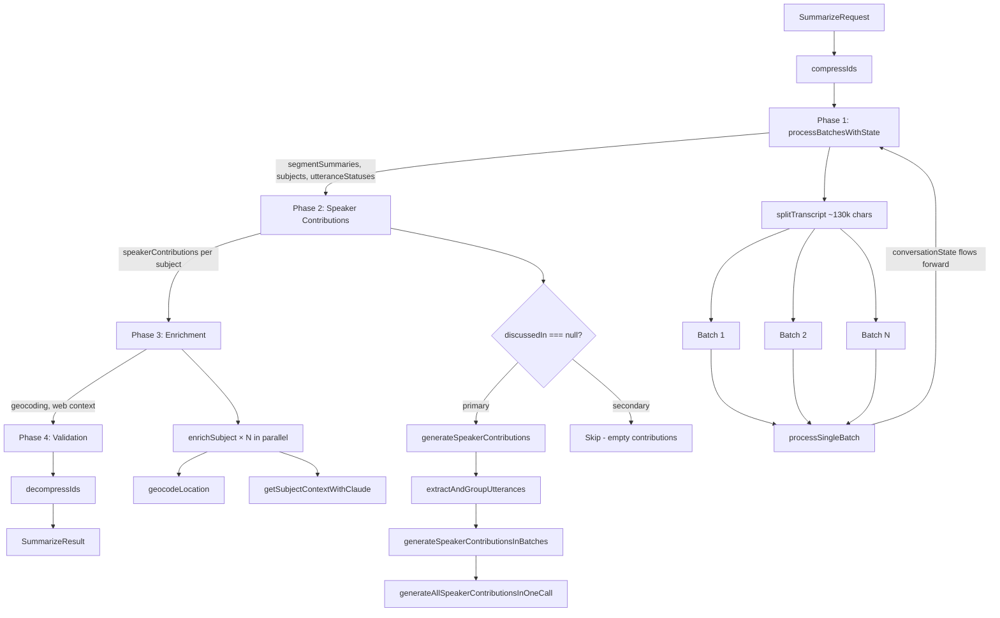

# Summarize Task

### Overview
Transforms a municipal council meeting transcript into structured data: per-segment summaries, discussion subjects with descriptions, per-speaker contributions, utterance-level discussion status tags, and enriched metadata (geocoding, web context). All LLM interactions use Claude via `aiChat`. IDs are compressed before processing and decompressed at the end to reduce token usage.

### Architecture
- Orchestration: src/tasks/summarize.ts
- Batch processing: src/tasks/summarize/batchProcessing.ts
- Speaker contributions: src/tasks/summarize/speakerContributions.ts
- Prompts: src/tasks/summarize/prompts.ts
- ID compression: src/tasks/summarize/compression.ts
- Types: src/tasks/summarize/types.ts
- Utilities: src/tasks/summarize/utils.ts
- Enrichment: src/lib/subjectEnrichment.ts

- Flow

### Input/Output Contract
- Input: SummarizeRequest (see src/types.ts)
  - transcript[]: speaker segments, each with speakerSegmentId, speakerId, speakerName, speakerParty, and utterances[] (utteranceId, text, startTimestamp)
  - existingSubjects[]: pre-populated subjects from the agenda (IN_AGENDA items with names, descriptions, introducedByPersonId)
  - requestedSubjects[]: subject names to prioritize if found in the transcript
  - cityName, date, topicLabels[], administrativeBodyName
  - additionalInstructions: optional free-text prompt additions
- Output: SummarizeResult (see src/types.ts)
  - speakerSegmentSummaries[]: per-segment summary with topicLabels and type (SUBSTANTIAL/PROCEDURAL)
  - subjects[]: full Subject objects with descriptions, speakerContributions, importance scores, location, context, discussedIn
  - utteranceDiscussionStatuses[]: per-utterance status tag (ATTENDANCE, SUBJECT_DISCUSSION, VOTE, OTHER) with subjectId

### Processing Pipeline

#### Phase 1: Batch Processing (`processBatchesWithState`)
Transcript is split into batches (~130k chars each via `splitTranscript`) and processed sequentially with a single LLM call per batch. Conversation state flows forward between batches.

1. **ID Compression** — All UUIDs (speakerSegmentId, speakerId, utteranceId, subject IDs) are compressed to short alphanumeric IDs via `IdCompressor` to reduce token usage. Decompressed at the end.

2. **Subject initialization** — Existing subjects from the agenda are converted to `SubjectInProgress` format via `initializeSubjectsFromExisting`, preserving their compressed IDs, agendaItemIndex, and introducedByPersonId.

3. **Per-batch LLM call** — Each batch sends the transcript chunk plus the current subject list to the LLM. The LLM returns:
   - `segmentSummaries[]`: 1-3 sentence summary per speaker segment, with topic labels and SUBSTANTIAL/PROCEDURAL type
   - `subjects[]`: the full updated subject list (existing subjects updated, new BEFORE_AGENDA/OUT_OF_AGENDA subjects created)
   - `utteranceStatuses[]`: every utterance in the batch tagged with a status and optional subjectId
   - `meetingProgressSummary`: 2-4 sentence Greek summary of where the meeting stands, passed to the next batch as context

4. **Post-batch validations** (applied in code after each LLM response):
   - **New subject ID registration**: LLM-created subject IDs are registered in the IdCompressor with deterministic UUIDs via `generateSubjectUUID`
   - **Utterance status ID correction**: references to LLM-generated IDs are remapped to the proper compressed IDs
   - **Introducer preservation**: `introducedByPersonId` from existing subjects is never overwritten by the LLM (bug fix for LLM substituting the chair)
   - **ID registration validation**: all subjectIds in utterance statuses are verified against the IdCompressor
   - **Joint discussion validation**: utterance statuses pointing to secondary subjects (those with `discussedIn` set) are auto-corrected to point to the primary subject
   - **Undiscussed subject preservation**: agenda items not returned by the LLM are re-added with `doNotNotify` importance

5. **State accumulation** — Segment summaries and utterance statuses accumulate across batches. The subject list is replaced each batch (LLM returns the full updated list).

#### Phase 2: Speaker Contributions (`generateSpeakerContributions`)
For each primary subject (where `discussedIn === null`), generates per-speaker contribution summaries.

1. **Utterance extraction** — Filters `allUtteranceStatuses` for `SUBJECT_DISCUSSION` matching the subject ID, then uses `extractAndGroupUtterances` to group by speaker from the transcript. Includes duplicate detection (same utterance in multiple segments).

2. **Batched generation** — Speakers are processed in batches of 15 (`INITIAL_BATCH_SIZE`). On failure, batch size halves down to minimum 2. Each batch calls `generateAllSpeakerContributionsInOneCall`.

3. **LLM call** — Receives the subject name/description, per-speaker utterance lists, and full chronological discussion context. Returns `SpeakerContribution[]` with speakerId and markdown text containing `REF:UTTERANCE:id` references.

4. **Validation** — Returned speakerIds are verified against the input set. Hallucinated speakers are filtered out. Contributions are deduplicated by speakerId.

5. **Secondary subjects** — Subjects with `discussedIn` set are skipped entirely and get empty `speakerContributions[]`.

#### Phase 3: Enrichment (`enrichSubjectData`)
All subjects are enriched in parallel via `Promise.all`:

1. **Geocoding** — If `locationText` is set, geocodes via Google Maps API (`geocodeLocation`), appending the city name for disambiguation.
2. **Web context** — Fetches background context via `getSubjectContextWithClaude` (Claude API with web search tool), returning context text and citation URLs.
3. **Assembly** — Constructs the final `Subject` object with location coordinates and context.

#### Phase 4: Validation (logging only)
Logs utterance distribution verification — counts of SUBJECT_DISCUSSION utterances per subject, ensuring coverage.

### Key Concepts

#### ID Compression
Long UUIDs are compressed to short IDs (e.g., `a1b2c3d4`) before any LLM interaction to reduce token count. The `IdCompressor` maintains a bidirectional mapping. New subjects created by the LLM during batch processing get deterministic UUIDs via `generateSubjectUUID` (based on name, description, agendaItemIndex) and are registered in the compressor. All IDs are decompressed in the final output, including `REF:TYPE:id` references embedded in markdown descriptions and contributions.

#### Conversation State Between Batches
Each batch receives:
- The current subject list (full objects, not just IDs)
- A `meetingProgressSummary` from the previous batch (Greek text describing meeting progress)

This allows the LLM to understand context continuity — whether the meeting is still in pre-agenda items, which agenda item is being discussed, and whether a topic continues from the previous batch.

#### Subject Types
- `IN_AGENDA`: Pre-existing from the agenda. Never created by the LLM — only updated (name/description refinement). Uses 1-based numeric `agendaItemIndex`.
- `BEFORE_AGENDA`: Created by the LLM for pre-agenda announcements and questions. Each distinct topic gets its own subject.
- `OUT_OF_AGENDA`: Created by the LLM for urgent items not on the original agenda.

#### Joint Discussion (`discussedIn`)
When multiple agenda items are discussed together, the first is the "primary" (discussedIn: null) and others are "secondary" (discussedIn: primary's ID). All utterance statuses and speaker contributions point to the primary subject only. Secondary subjects get empty speakerContributions.

#### Utterance Status Tagging
Each utterance is directly tagged (replaces an older range-based system):
- `ATTENDANCE`: roll call — subjectId: null
- `SUBJECT_DISCUSSION`: substantive discussion — subjectId required
- `VOTE`: voting/counting — subjectId required
- `OTHER`: procedural without specific subject — subjectId: null

#### Markdown References
Descriptions and speaker contributions use special markdown links: `[text](REF:TYPE:compressedId)` where TYPE is UTTERANCE, PERSON, or PARTY. These are decompressed to full UUIDs in the final output by `decompressReferencesInMarkdown`.

### Dependencies
- External services: Anthropic Claude API (batch processing, speaker contributions, web context), Google Maps Geocoding API
- Libraries: @anthropic-ai/sdk, dotenv

### Integration Points
- Task pipeline invokes `summarize` via `TaskManager.registerTask()`
- CLI: available as a CLI command
- Enrichment shared with processAgenda task via `enrichSubjectData`
- Dev endpoints: `/dev/test-task/summarize`

### Configuration
- Env vars:
  - `ANTHROPIC_API_KEY` — Claude API access
  - `GOOGLE_MAPS_API_KEY` — geocoding (via src/lib/geocode.ts)
- Batch processing:
  - `splitTranscript` max chunk size: 130,000 chars
  - Speaker contribution batch size: 15 (halves on failure, minimum 2)
- LLM options:
  - `cacheSystemPrompt: true` — system prompt cached across batches and speaker contribution calls

### Key Functions & Utilities

**Orchestration (src/tasks/summarize.ts)**
- `summarize(request, onProgress)` — main task entry point

**Batch Processing (src/tasks/summarize/batchProcessing.ts)**
- `processBatchesWithState(request, idCompressor, onProgress)` — splits transcript, processes sequentially, accumulates state
- `processSingleBatch(batch, batchIndex, totalBatches, conversationState, metadata, previousMeetingProgressSummary)` — single LLM call for one batch

**Speaker Contributions (src/tasks/summarize/speakerContributions.ts)**
- `generateSpeakerContributions(subject, allUtteranceStatuses, transcript, idCompressor, administrativeBodyName)` — entry point per subject
- `extractAndGroupUtterances(utteranceStatuses, transcript)` — filters and groups utterances by speaker with duplicate detection
- `generateSpeakerContributionsInBatches(utterancesBySpeaker, allSubjectUtterances, subject, idCompressor, administrativeBodyName)` — adaptive batching with retry
- `generateAllSpeakerContributionsInOneCall(...)` — single LLM call for a speaker batch

**Compression (src/tasks/summarize/compression.ts)**
- `compressIds(request, idCompressor)` — compress all IDs in the request
- `decompressIds(result, idCompressor)` — decompress all IDs in the result, including markdown REF: links
- `decompressReferencesInMarkdown(markdown, idCompressor)` — regex replacement of REF:TYPE:shortId patterns

**Prompts (src/tasks/summarize/prompts.ts)**
- `getBatchProcessingSystemPrompt(metadata)` — Greek system prompt covering segment summaries, subject management, and utterance tagging rules
- `getSpeakerContributionsSystemPrompt(administrativeBodyName)` — Greek system prompt for generating per-speaker contribution summaries

**Utilities (src/tasks/summarize/utils.ts)**
- `splitTranscript(transcript, maxLengthChars)` — splits by JSON-serialized character length
- `initializeSubjectsFromExisting(existingSubjects)` — converts to SubjectInProgress format
- `getStatusEmoji(status)` — logging helper

**Enrichment (src/lib/subjectEnrichment.ts)**
- `enrichSubjectData(input, id, config)` — geocode + web context + final Subject assembly

### Data Flow & State Management
- Stateless per request; no persistent state between task invocations.
- Conversation state within a request flows sequentially through batches (subjects list + meeting progress summary).
- Utterance statuses accumulate across batches (simple concatenation).
- Phase 3 enrichment runs all subjects in parallel.
- Token usage is tracked per phase and reported at completion.
