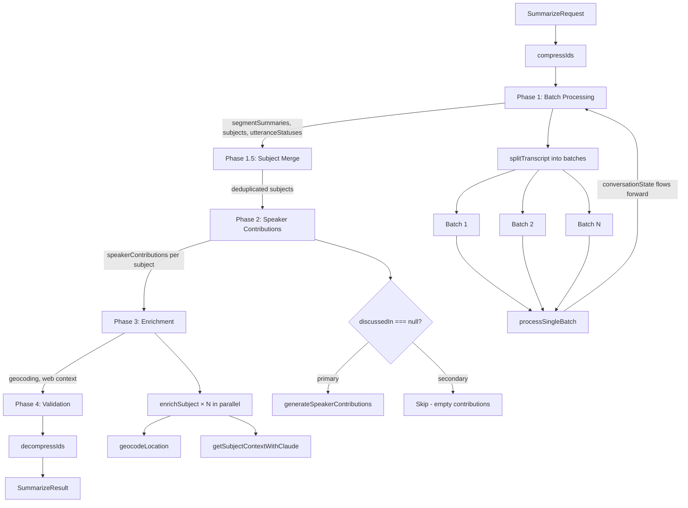

# Summarize Task

### Overview
Transforms a municipal council meeting transcript into structured data: per-segment summaries, discussion subjects with descriptions, per-speaker contributions, utterance-level discussion status tags, and enriched metadata (geocoding, web context).

Orchestration: `src/tasks/summarize.ts`
Types: `SummarizeRequest` / `SummarizeResult` in `src/types.ts`

### Flow

```mermaid
flowchart TD
  A[SummarizeRequest] --> B[compressIds]
  B --> C[Phase 1: Batch Processing]
  C --> |segmentSummaries, subjects, utteranceStatuses| M[Phase 1.5: Subject Merge]
  M --> |deduplicated subjects| D[Phase 2: Speaker Contributions]
  D --> |speakerContributions per subject| E[Phase 3: Enrichment]
  E --> |geocoding, web context| F[Phase 4: Validation]
  F --> G[decompressIds]
  G --> H[SummarizeResult]

  C --> C1[splitTranscript into batches]
  C1 --> C2[Batch 1]
  C1 --> C3[Batch 2]
  C1 --> C4[Batch N]
  C2 --> C5[processSingleBatch]
  C3 --> C5
  C4 --> C5
  C5 --> |conversationState flows forward| C

  D --> D1{discussedIn === null?}
  D1 -- primary --> D2[generateSpeakerContributions]
  D1 -- secondary --> D3[Skip - empty contributions]

  E --> E1[enrichSubject × N in parallel]
  E1 --> E2[geocodeLocation]
  E1 --> E3[getSubjectContextWithClaude]
```

### Key Concepts

#### ID Compression
Long UUIDs are compressed to short IDs before any LLM interaction to reduce token count. `IdCompressor` maintains a bidirectional mapping. New subjects created by the LLM get deterministic UUIDs via `generateSubjectUUID`. All IDs — including `REF:TYPE:id` references in markdown — are decompressed in the final output.

#### Conversation State Between Batches
Each batch receives the current subject list and a `meetingProgressSummary` (Greek text) from the previous batch. This gives the LLM continuity: whether the meeting is in pre-agenda items, which agenda item is active, whether a topic continues from the prior batch.

#### Subject Types
- **`IN_AGENDA`**: From the agenda. Never created by the LLM — only updated. Uses 1-based `agendaItemIndex`.
- **`BEFORE_AGENDA`**: Created by the LLM for pre-agenda announcements/questions.
- **`OUT_OF_AGENDA`**: Created by the LLM for urgent items not on the original agenda.

#### Subject Merge (Phase 1.5)
After batch processing, subjects created independently across batches may overlap or fragment. `mergeSubjects` uses an LLM call to deduplicate them. Only `BEFORE_AGENDA` subjects can be merged away; `IN_AGENDA` and `OUT_OF_AGENDA` subjects are always preserved. Utterance statuses referencing merged subjects are remapped to the surviving subject.

#### Joint Discussion (`discussedIn`)
When multiple agenda items are discussed together, the first is the "primary" (`discussedIn: null`) and others are "secondary" (`discussedIn: primaryId`). All utterance statuses and speaker contributions point to the primary. Secondary subjects get empty `speakerContributions`.

#### Utterance Status Tagging
Each utterance is tagged directly:
- `ATTENDANCE`: roll call — `subjectId: null`
- `SUBJECT_DISCUSSION`: substantive discussion — `subjectId` required
- `VOTE`: voting/counting — `subjectId` required
- `OTHER`: procedural without specific subject — `subjectId: null`

#### Markdown References
Descriptions and speaker contributions use `[text](REF:TYPE:compressedId)` links where TYPE is `UTTERANCE`, `PERSON`, or `PARTY`. Decompressed to full UUIDs in the final output.

### Dependencies
- **Anthropic Claude API**: batch processing, speaker contributions, subject merge, web context
- **Google Maps Geocoding API**: location enrichment
