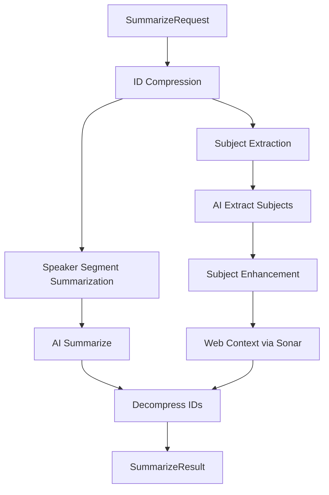
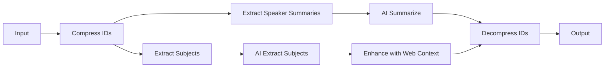

# Summarize Task

## Overview
The summarize task transforms raw council meeting transcripts into structured, meaningful content by performing two core functions: generating concise summaries of individual speaker segments and extracting structured discussion topics (subjects) from the meeting. It serves as the central AI processing component that converts unstructured transcript data into searchable, categorized content for the OpenCouncil platform.

## Architecture
The task implements a two-phase processing architecture with ID compression optimization. The main entry point orchestrates speaker segment summarization and subject extraction, then enhances subjects with web context before returning decompressed results. Key architectural decisions include chunked processing for large transcripts, incremental subject extraction with state preservation, and parallel web context enhancement.

**File References**: [summarize.ts](src/tasks/summarize.ts), [types.ts](src/types.ts), [ai.ts](src/lib/ai.js), [sonar.ts](src/lib/sonar.js), [processAgenda.ts](src/tasks/processAgenda.ts), [utils.ts](src/utils.ts)

## Input/Output Contract
- **Input**: Expects a processed transcript with speaker identification, existing subjects from agenda processing, requested subjects for targeted extraction, and optional additional instructions. The transcript must include speaker segments with utterances, topic labels, city information, and party details.
- **Output**: Produces speaker segment summaries with topic labels and categorization, plus enhanced subjects with web context, speaker segments, highlighted utterances, and location data. All outputs maintain referential integrity through ID mapping.
- **File References**: [SummarizeRequest](src/types.ts), [SummarizeResult](src/types.ts), [RequestOnTranscript](src/types.ts), [Subject](src/types.ts)

## Processing Pipeline
The task executes in four sequential phases with chunked processing for scalability:

1. **ID Compression**: Compresses long UUIDs to short integers for efficient AI processing using [IdCompressor](src/utils.ts)
2. **Speaker Segment Summarization**: Filters segments ≥10 words, chunks into 200K character prompts, processes via Claude Sonnet 4 with Greek-optimized prompts
3. **Subject Extraction**: Processes transcript in 130K character chunks, maintains incremental subject state, merges new subjects with existing ones
4. **Enhancement & Decompression**: Enhances subjects with web context via Perplexity Sonar, decompresses IDs back to original format

## Dependencies
- **Anthropic Claude Sonnet 4** (`claude-sonnet-4-20250514`): Primary AI model for summarization and subject extraction, requires `ANTHROPIC_API_KEY`, implements rate limiting and retry logic
- **Perplexity Sonar Pro**: Provides web context for extracted subjects, requires `PERPLEXITY_API_KEY`, includes citation URLs
- **Google Maps API**: Used indirectly through [processAgenda](src/tasks/processAgenda.ts) for geocoding subject locations, requires `GOOGLE_API_KEY`

## Integration Points
- **API Endpoint**: `POST /summarize` registered via [TaskManager](src/lib/TaskManager.ts) with async processing and callback support
- **Task Manager**: Integrated with [TaskManager](src/lib/TaskManager.ts) for queue management, progress tracking, and parallel execution limits
- **Related Tasks**: Works with [processAgenda](src/tasks/processAgenda.ts) for initial subject structure, [fixTranscript](src/tasks/fixTranscript.ts) for transcript cleaning, [generatePodcastSpec](src/tasks/generatePodcastSpec.ts) and [generateHighlight](src/tasks/generateHighlight.ts) for content generation
- **Routing**: Registered in [server.ts](src/server.ts) with Swagger documentation generation

## Configuration
- `ANTHROPIC_API_KEY`: Required for Claude API access, used for all AI processing operations
- `PERPLEXITY_API_KEY`: Required for Perplexity Sonar API access, used for web context enhancement
- `MAX_PARALLEL_TASKS`: Controls concurrent task execution limit (default: 10), affects overall system throughput
- `LOG_DIR`: Directory for AI operation logs (default: current working directory), stores request/response data for debugging

## Key Functions & Utilities
- **`summarize`**: Main task entry point that orchestrates the complete summarization pipeline
- **`extractSpeakerSegmentSummaries`**: Processes individual speaker segments, filters short segments, and generates AI summaries
- **`extractSubjects`**: Extracts and structures discussion topics from transcript chunks with incremental state management
- **`aiExtractSubjects`**: Core AI processing function for subject extraction with chunked transcript processing
- **`aiSummarize`**: Core AI processing function for speaker segment summarization with prompt chunking
- **`splitTranscript`**: Utility for splitting large transcripts into manageable chunks (130K characters)
- **`splitUserPrompts`**: Utility for splitting user prompts into optimal sizes (200K characters)
- **`getExtractSubjectsSystemPrompt`**: Generates Greek-optimized system prompts for subject extraction
- **`getSummarizeSystemPrompt`**: Generates Greek-optimized system prompts for speaker summarization
- **`speakerSegmentToPrompt`**: Formats speaker segments into structured prompts for AI processing

## Data Flow & State Management
The task implements stateless processing with temporary state management during execution. Key patterns include:

- **ID Compression**: Uses [IdCompressor](src/utils.ts) to temporarily compress long UUIDs to short integers for efficient AI processing, then decompresses results
- **Chunked Processing**: Splits large transcripts into manageable chunks to handle arbitrarily large inputs while maintaining context
- **Incremental Subject State**: Maintains and updates existing subjects across transcript chunks, preventing duplicates through name-based matching
- **Parallel Enhancement**: Processes subject web context enhancement concurrently using `Promise.all()` for improved performance
- **Progress Tracking**: Implements callback-based progress reporting for real-time status updates during long-running operations
- **Error Resilience**: Continues processing remaining chunks even if individual chunks fail, with comprehensive error logging
